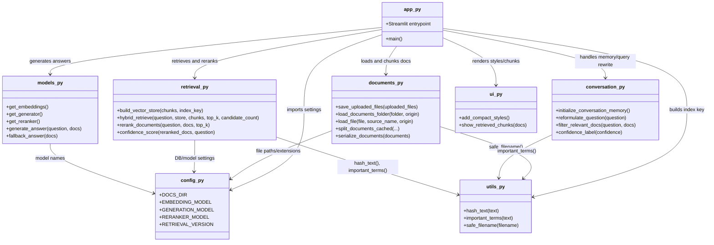

# Local Hugging Face RAG 

This project is a basic local RAG system using Streamlit, Hugging Face models, recursive chunking, broad document loading, caching, and a persistent ChromaDB vector database.

## What It Uses

- `Streamlit` for the web UI
- `RecursiveCharacterTextSplitter` for chunking documents
- `sentence-transformers/all-MiniLM-L6-v2` for Hugging Face embeddings
- `ChromaDB` for local persistent vector search
- `BM25Retriever` plus semantic retrieval for hybrid search
- Optional `BAAI/bge-reranker-base` cross-encoder reranking
- A persisted `vector_db/` folder so the same index can be reused
- A persisted `uploaded_docs/` folder for files uploaded through the UI
- Streamlit caching for chunking, embeddings, and generation models
- `google/flan-t5-small` for local Hugging Face answer generation
- `pypdf` for reading PDF files
- `unstructured` for parsing many other document formats
- `pandas` and `openpyxl` for direct Excel loading

## Install

```bash
pip install -r requirements.txt
```

The first run may download Hugging Face models, so it can take a little while.

## Run

```bash
streamlit run app.py
```

Then open the local Streamlit URL shown in the terminal.

## How It Works

1. Recursively loads readable files from `docs/`.
2. Saves uploaded documents into `uploaded_docs/` so they remain available after restart.
3. Splits documents with recursive chunking.
4. Creates embeddings with a Hugging Face sentence-transformer model.
5. Stores the embeddings in a persistent ChromaDB vector database.
6. Retrieves with hybrid semantic + BM25 search.
7. Optionally reranks retrieved chunks with a cross-encoder.
8. Shows confidence and source references.
9. Sends the retrieved context to a Hugging Face generation model.

## Modular Architecture

This branch organizes the RAG app into focused modules inside `rag_app/` so document processing, retrieval, model loading, conversation helpers, and UI rendering stay easier to understand and maintain.



## Module Roles

- `app.py`: orchestrates the full Streamlit workflow.
- `rag_app/config.py`: centralizes paths, model names, extensions, and retrieval constants.
- `rag_app/utils.py`: reusable helpers for hashing, keyword extraction, and filename sanitization.
- `rag_app/documents.py`: handles uploads, file parsing, serialization, and chunking.
- `rag_app/models.py`: loads embedding, generation, and reranker models and builds answers.
- `rag_app/conversation.py`: manages session memory, query rewriting, and lightweight relevance logic.
- `rag_app/retrieval.py`: manages Chroma, BM25, hybrid retrieval, reranking, and confidence scoring.
- `rag_app/ui.py`: contains Streamlit styling and retrieved-chunk display helpers.

## Files

```text
app.py              Streamlit RAG app
rag_app/            Modular RAG package
requirements.txt    Python dependencies
docs/               Local knowledge base
uploaded_docs/      Uploaded documents saved by the app
vector_db/          Local persisted ChromaDB index, created at runtime
```
## File Support

Text files, PDFs, and Excel files are handled directly. Other formats are passed through `unstructured`, which supports many common document types such as Office files, HTML, emails, and more. Very specialized or encrypted binary files may still be skipped if no readable text can be extracted.
